# **AiKit UI 介绍**

使用Python + Opencv + pyqt5 在机械臂上进行颜色识别、形状识别、特征点图像识别、AR二维码识别和 YOLOv5 图像识别

- **适用机型设备:** 
  - myPalletizer 260 for M5
  - myCobot 280 for M5
  - mechArm 270 for M5
  - myCobot 280 for Pi
  - mechArm 270 for Pi
  - myPalletizer 260 for Pi

## 1 运行环境

Linux 树莓派系统、Windows 10 or Windows 11，末端执行器仅支持myCobot 垂直吸泵2.0

## 2 安装代码

```bash
git clone -b Convenient_AiKit https://github.com/elephantrobotics/AiKit_UI.git
```

## 3 python 依赖库安装

```bash
cd AiKit_UI
pip install -r requirements.txt
```

## 4 启动程序

路径切换到项目文件夹，运行main.py脚本

```bash
cd AiKit_UI
python main.py
```

启动成功之后如下图所示：<br>

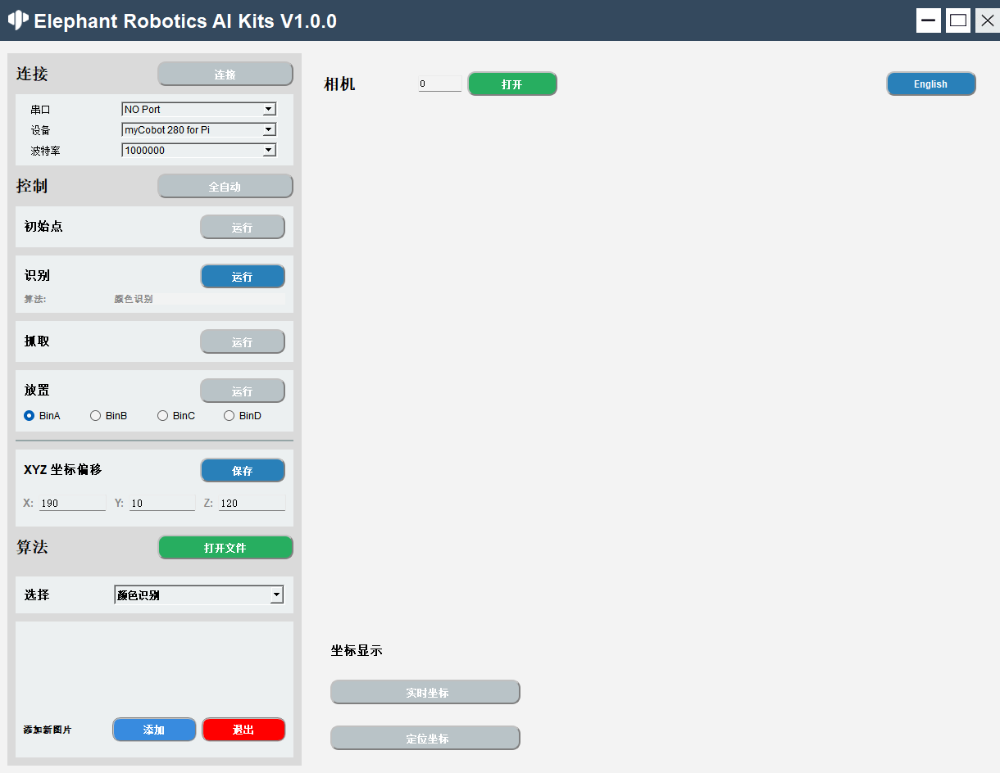

### 功能介绍

#### 语言切换

点击窗口右上角的按钮可以进行语言（中文、英文）之间的切换。<br>
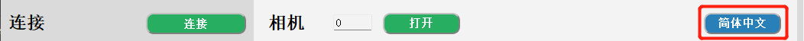

#### 设备连接

1. 选择串口、设备、波特率<br>
   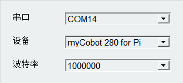
2. 点击'连接'按钮进行连接，连接成功之后’连接‘按钮会变成'断开'<br>
   
3. 点击’断开‘按钮会断开与机械臂的连接<br>
   
4. 成功连接机械臂之后，灰色按钮将会被点亮，变为可点击状态。<br>
   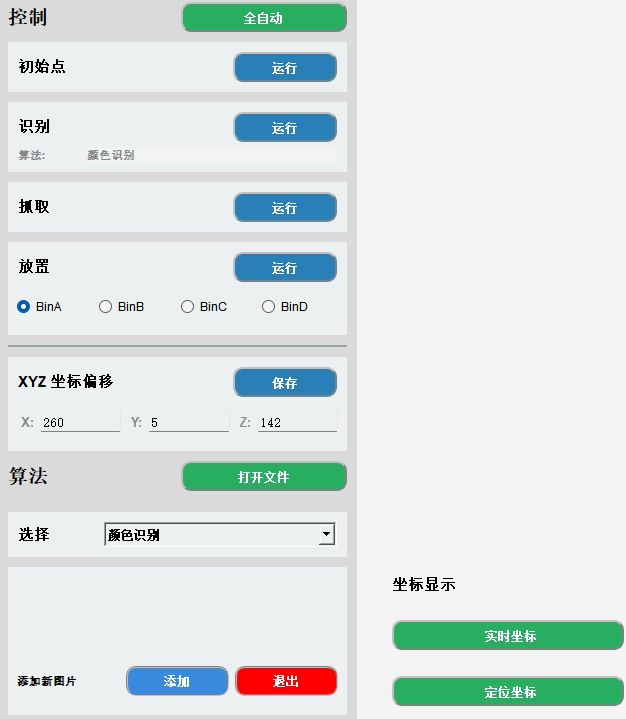

#### 打开相机

1. 设置相机序号，默认的序号为0，Windows使用时，通常序号为1，Linux使用时，序号通常为0。<br>
   

2. 点击‘打开’按钮则可以尝试打开相机，若是打开失败，则应该尝试更改相机序号；相机成功打开如下图所示：
   注意：使用之前应该调整摄像头刚好在二维码白板的正上方，且呈一条直线正对机械臂。<br>

   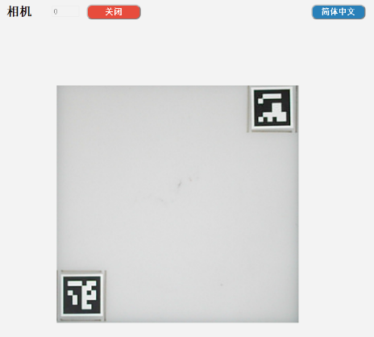

3. 成功打开摄像头之后，点击'关闭'按钮关闭摄像头<br>
   

#### 算法控制

1. 全自动模式，点击'全自动'按钮之后，识别、抓取、放置将一直处于打开状态；再次点击'全自动'按钮关闭全自动模式。<br>
   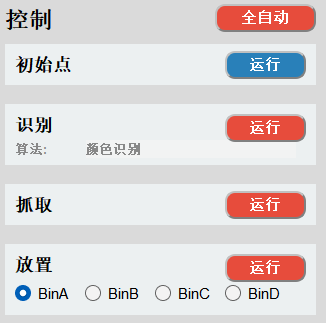

2. 回到抓取初始点位，点击’运行‘按钮，会停止当前正进行的操作，回到初始点位。<br>
   

3. 逐步操作模式
   识别：点击’运行‘按钮开始识别，算法是当前使用的算法。<br>
   
   抓取：点击’运行‘按钮开始抓取，抓取成功之后，自动关闭识别和抓取，下次使用需要再次点击。<br>
   
   放置：点击’运行‘按钮开始放置，BinA，BinB，BinC，BinD选择框分别对应BinA，BinB，BinC，BinD4个存储盒，选择后会放置到指定的存储盒。<br>
   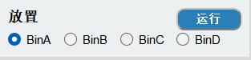

4. 抓取点位调节，X 偏移量、Y 偏移量、Z 偏移量分别代表的是机械臂坐标X轴、Y轴、Z轴的位置，可以根据实际需求进行修改，点击’保存‘按钮进行保存，保存成功后将会按照最新点位进行抓取。<br>
   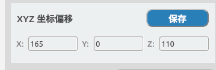<br>
   

5. 打开文件位置，我们的代码是开源的，你可以根据自己的需求进行修改，点击’打开 File‘按钮会打开文件所在位置。<br>
   
   打开’main.py‘文件进行修改即可<br>
   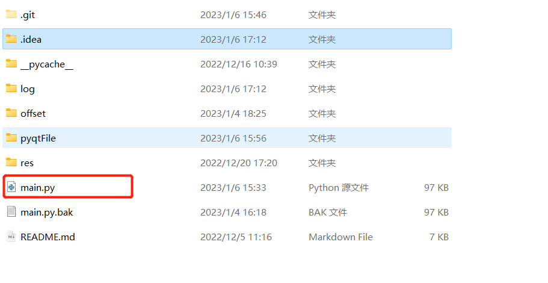
   
6. 算法选择，分别有颜色识别，形状识别，二维码识别，特征点识别 yolov5，选择对应的算法将进行对应的识别。<br>

   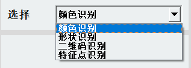

7. 为‘特征点识别‘添加图片<br>
   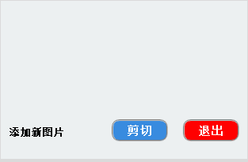
   点击’添加'按钮，则会打开相机以及出现提示。<br>
   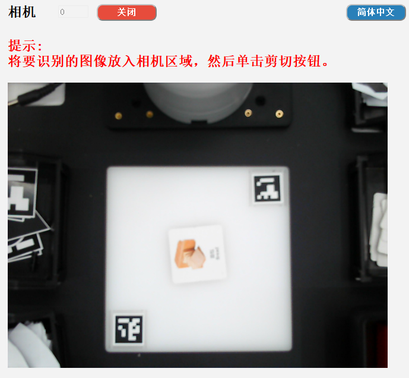
   点击‘剪切’按钮，则会截取当前相机内容，并给出提示‘框出需要保存的内容后按下ENTER键’<br>

   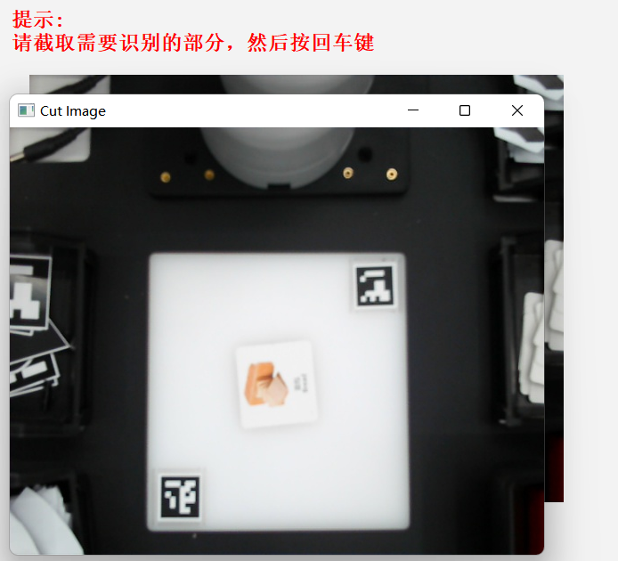
   框出需要保存的内容后按下ENTER键，开始选择保存的区域，分别对应BinA，BinB，BinC，BinD4个存储盒。<br>

   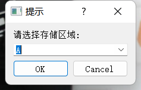
   此处会显示截取的内容<br>
   

   可进入以下路径查看保存的图片<br>
   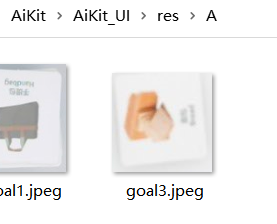

8. 点击‘退出'按钮退出图片添加，注意：若是开始截取，请截取完之后再退出，可选择不保存截取的图片。<br>
   

#### 坐标显示

1. 机械臂实时坐标显示：点击’实时坐标'按钮开启<br>
   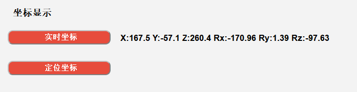
2. 识别坐标显示：点击''定位坐标'按钮开启<br>
   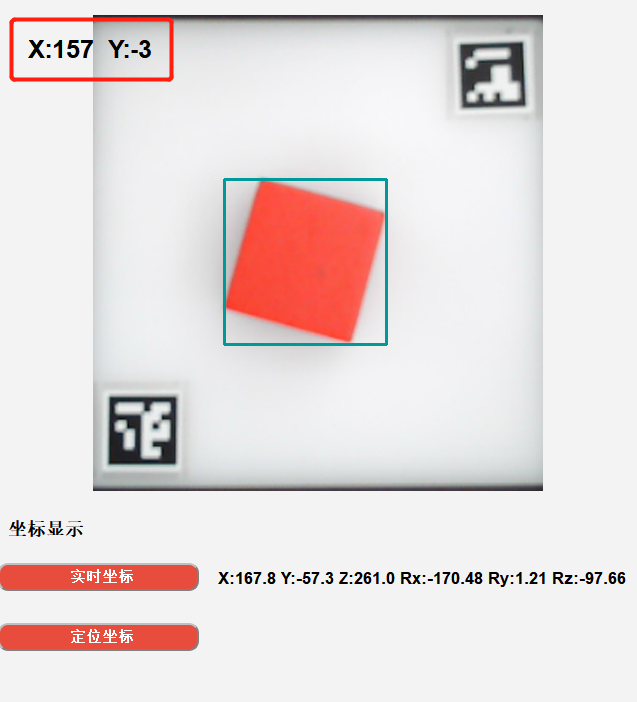
