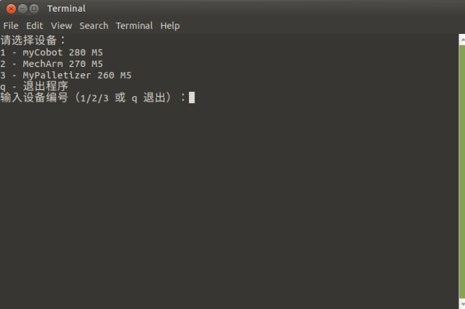
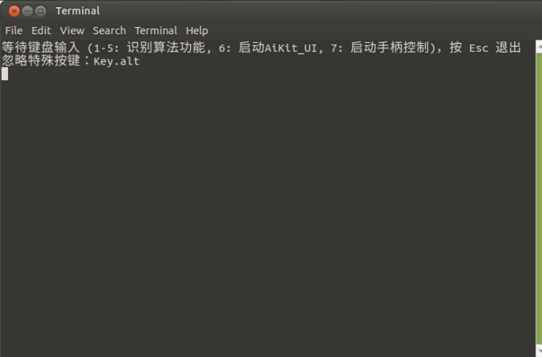
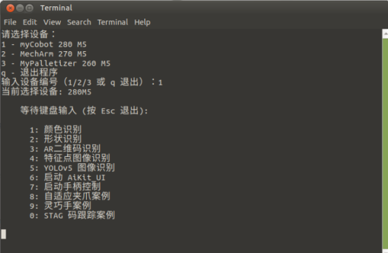

# AiKit Convenient Kit

Use Python + OpenCV to perform color recognition, shape recognition, feature point image recognition, AR QR code recognition, and YOLOv5 image recognition on the robotic arm. It also supports launching the AiKit_UI graphical software and handle control program. It also supports demonstrations of the myCobot adaptive gripper case, the myCobot five-finger dexterous hand case, and the myCobot camera flange stag code tracking case.

## 1 Supported Robot Arm Models

- myCobot 280 M5
- myCobot 280 PI
- myPalletizer 260 M5
- myPalletizer 260 PI
- MechArm 270 M5
- MechArm 270 PI

## 2 Operating Environment

Linux Raspberry Pi system + package components + USB integrated keyboard and mouse controller. The end effector supports myCobot Vertical Suction Pump 2.0, myCobot Adaptive Gripper, myCobot Five-Finger Dexterous Hand, and myCobot Camera Flange.

## 3 Code Installation

```bash
cd ~
git clone https://github.com/elephantrobotics/convenient_aikit.git
```

## 4 Dependency Library Installation

```bash
cd ~/convenient_aikit
pip install -r requirements.txt
```

## 5 Setting up autostart

1. Grant executable permissions to the script:

```bash
cd ~/convenient_aikit
sudo chmod +x start_aikit*.sh
```

2. Copy the autostart script `.desktop file` to the `~/.config/autostart` folder. Different scripts are used for different devices.

- 280M5, 270M5, and 260M5 devices:

```bash
cd ~/convenient_aikit
cp aikit_autostart.desktop $HOME/.config/autostart/aikit_autostart.desktop
```

- 280PI devices:

```bash
cd ~/convenient_aikit
cp aikit_autostart_280PI.desktop $HOME/.config/autostart/aikit_autostart_280PI.desktop
```

- 270PI devices:

```bash
cd ~/convenient_aikit
cp aikit_autostart_270PI.desktop $HOME/.config/autostart/aikit_autostart_270PI.desktop
```

- 260PI devices:

```bash
cd ~/convenient_aikit
cp aikit_autostart_260PI.desktop $HOME/.config/autostart/aikit_autostart_260PI.desktop
```

3. Verifying Auto-Start

After restarting the system, a terminal will pop up on the desktop, as shown below:

- 280M5, 270M5, and 260M5 devices:

    

- 280/270/260PI devices:

    

This indicates that the program has successfully started automatically.

## 6 Function Usage

Supports color recognition, shape recognition, feature point image recognition, AR QR code recognition, YOLOv5 image recognition, AiKit_UI program, handle control program, adaptive gripper case, five-finger dexterous hand case, and stag code tracking case.


### Device Selection

Follow the terminal prompts and select the corresponding robot arm model. If you are using a PI version device, skip this step. Here, we use the 280M5 as an example:



### Key Function Description

>> Note: Before use, ensure that the robot arm device and related USB devices are properly connected.

Keyboard Input:

`1`: Press 1 to activate color recognition.

`2`: Press 2 to activate shape recognition.

`3`: Press 3 to activate AR QR code recognition.

`4`: Press 4 to activate feature point image recognition.

`5`: Press 5 to activate YOLOv5 recognition. Place the YOLOv5 image block in the recognition area. Following the prompts displayed in the terminal, place the mouse cursor over the camera window and press the letter z on the keyboard to initiate the grabbing process.

`6`: Press 6 to activate AiKit_UI graphical software, allowing you to directly use various recognition algorithms. [AiKit UI User Guide](./AiKit_UI/README.md)

`7`: Press 7 to activate controller control. After startup, switch your keyboard and mouse to controller mode. For controller button usage, refer to [Function Button Usage](https://docs.elephantrobotics.com/docs/mycobot_280_pi_en/3-FunctionsAndApplications/6.developmentGuide/python/9_HandleControl.html).

`8`: After switching to keyboard mode, press the number 8 to activate the myCobot Adaptive Gripper demonstration. The robot performs a fixed up-and-down motion, with the adaptive gripper opening and closing three times, finally gripping a wooden block from point A to point B and returning to zero.

`9`: Press the number 9 to activate the myCobot Five-Finger Dexterous Hand demonstration. The robot performs a left-right greeting motion twice. The five-fingered dexterous hand forms a central fist (palm facing down), moves forward and backward, performs a fist bump motion twice, and finally returns to zero.

`0`: Press the number 0 to activate the Stag Code Tracking demonstration. The robot arm first moves to the initial observation point position. Then, the Stag Code wooden block is placed 30 cm away from the camera flange at the end of the robot arm, and the robot arm begins tracking.

### Coordinate Offsets

When running the 1-5 recognition algorithms, if the robot arm cannot accurately grasp a recognized object or block, adjust the XYZ offsets based on the algorithm. Press 6 to launch the AiKit_UI graphical software and modify the offsets: [AiKit UI User Guide](./AiKit_UI/README.md)

### Notes

1. The coordinate grabbing offsets in the recognition algorithm functions for keyboard keys 1 to 5 depend on the offsets in AiKit_UI. Therefore, to adjust the coordinate offsets, press `6` to launch the AiKit_UI program, make the changes, and save the changes.

2. The program supports direct switching of recognition algorithm functions. For example, if you are currently running the **color recognition function**, you can directly press `2` to switch to the **shape recognition function**. If you are currently running the **AiKit_UI** program, you must manually close the program in the upper-right corner of the UI program before you can switch to other recognition algorithm functions.

3. If the camera doesn't automatically define the recognition area correctly, close the program and adjust the camera's position, such as by moving it left or right.

4. OpenCV color recognition is affected by the environment. Recognition performance will be significantly reduced in low light or bright conditions.

5. Different recognition algorithms are used for different materials. Please select the appropriate one.

